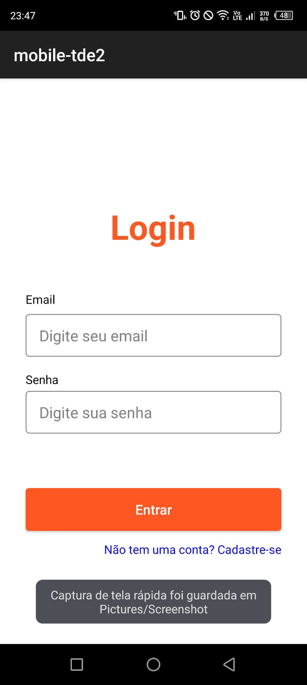
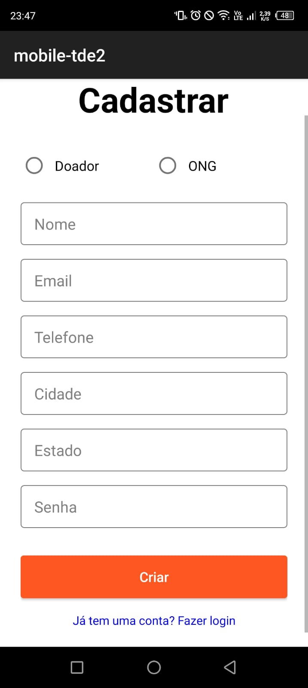
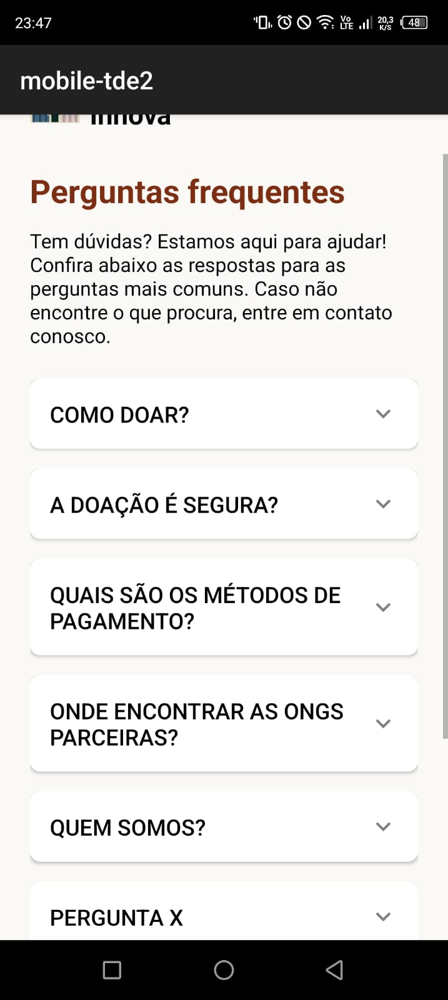
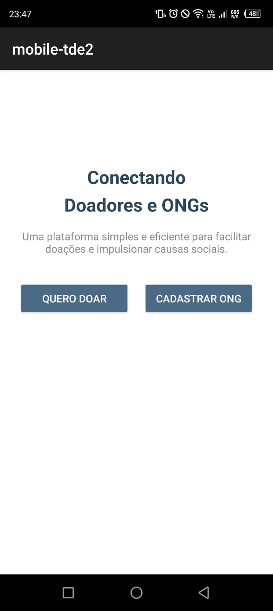

# 📱 App ONG

Este é um aplicativo desenvolvido como trabalho da faculdade, com o objetivo de auxiliar na gestão de uma ONG (Organização Não Governamental). O projeto foi desenvolvido em Kotlin, utilizando recursos da plataforma Android.

---

## 🚀 Funcionalidades

- ✅ Cadastro de animais
- ✅ Cadastro de doadores
- ✅ Registro de adoções
- ✅ Perguntas frequentes (FAQ)
- ✅ Gerenciamento de informações da ONG
- ✅ Login
- ✅ Escolha de perfil: ONG ou Doador

---

## 🛠️ Tecnologias Utilizadas

- Kotlin
- Android SDK

---

## 💻 Como Executar o Projeto

1. Clone o repositório:

   ```bash
   git clone https://github.com/luisz19/app-ong.git

2. Abra o projeto no Android Studio.

3. Aguarde a sincronização das dependências.

4. Conecte um emulador ou dispositivo físico.

5.Execute o projeto.

---

## 🖼️ Screenshots

### 🔐 Tela de Login


---

### 🆕 Tela de Cadastro


---

### ❓ Perguntas Frequentes (FAQ)


---

### 👥 Escolha: ONG ou Doador


---

## 📄 Licença

Este projeto é apenas para fins acadêmicos e não possui licença de distribuição.

---
